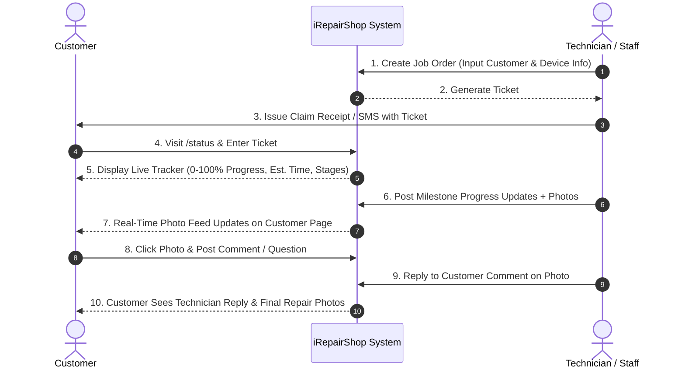

# Customer Device Tracking & Reference System Guide

This guide explains how customers track their repair devices, how reference ticket numbers are generated, and how customer communication works in the iRepairShop System.

---

## 1. How Reference Ticket Numbers Are Generated

When a technician or staff member creates a new repair job order (via `JobOrders` -> `Create New Ticket`):

1. **Ticket Number (`JO-YYYY-XXXX`)**:
   - The system automatically generates a unique sequential ticket number formatted as:  
     `JO-[YEAR]-[0001]` (e.g., `JO-2026-0001`, `JO-2026-0002`).
2. **Unique Tracking Token**:
   - A secure, unique alphanumeric tracking token is attached to the job order (e.g., `tr_a8f92b7c`).
3. **QR Code Identifier**:
   - The ticket number is encoded into a scannable QR code embedded directly onto the printable customer receipt.

### How the Reference Number is Given to the Customer

- **Printable Receipt / Claim Check**:
  - The customer receives a physical or digital claim receipt containing the **Ticket Number (`#JO-2026-0001`)**, a **scannable QR Code**, and the **Direct Tracking URL**.
- **Automated SMS & Email Notification Log**:
  - Upon creation, an automated notification log is recorded with a message sent to the customer's phone/email:
    > *"Welcome to iRepairShop! Ticket #JO-2026-0001 has been opened for your iPhone 15 Pro. Track your repair status online: https://yourshop.com/status/JO-2026-0001"*

---

## 2. How Customers Access & Track Their Device

Customers can track their device in **two convenient ways** (no account registration or login required):

### Method A: Public Status Lookup Page (`/status`)
1. Customer visits the public portal URL: `/status`.
2. Customer enters their **Ticket Number** (e.g., `JO-2026-0001`), **QR Code string**, or **Tracking Token**.
3. The system validates the entry and immediately redirects the customer to their dedicated live tracking page.

### Method B: Direct Link or QR Code Scan
1. Customer scans the QR code on their receipt using their phone camera, OR clicks the link sent via SMS/Email (`/track/{token}` or `/status/{ticket_number}`).
2. The page opens directly to their live repair tracking dashboard.

---

## 3. What Customers Can See & Do on the Tracking Portal

The live repair tracker (`resources/views/status/show.blade.php`) gives customers 100% transparency over their device repair process:

### 📱 A. Live Progress & Estimated Completion
- **Real-time Percentage Bar**: Shows completion progress (0% to 100%).
- **Estimated Completion Date & Countdown**: Displays expected completion date and estimated remaining hours.
- **Interactive 8-Stage Pipeline Indicator**: Highlights current stage:
  1. `Received`
  2. `Diagnosis`
  3. `Awaiting Parts`
  4. `Under Repair`
  5. `Testing/QC`
  6. `Ready for Pickup`
  7. `Completed`
  8. `Released`

### 📸 B. Photo Milestone Feed & Timeline
- Technical staff post milestone updates as they work on the device.
- Customers view photos uploaded at each stage (e.g., disassembled motherboard, replaced battery, clean assembly).
- Includes exact timestamps and technician progress descriptions.

### 💬 C. Interactive Photo Comments & Communication
- Customers can click any photo in the milestone gallery or intake before/after gallery to open an interactive **Photo Modal**.
- **Two-Way Chat on Photos**:
  - Customers can type questions or notes on specific photos (e.g., *"Is that scratch on the frame pre-existing?"*).
  - Comments display sender badges (`Customer` vs `Technician/Staff`).
  - Technicians and staff receive these comments and can reply directly to the customer on that photo thread.

### 📑 D. Pending Customer Approval Requests (Interactive Consent)
If a technician discovers additional damage or necessary repairs (e.g., secondary IC chip failure):
- A prominent **Action Required** card appears on the customer's tracking page.
- Displays the additional cost (₱), extra estimated repair time (days), and technician's note.
- Customer can click **Approve Additional Repair** or **Decline Request** directly from their phone/browser.

### 🔄 E. Before vs. After Comparison Slider
- Once the repair reaches `Ready for Pickup` or `Completed`, the customer can view a side-by-side visual comparison of their device condition before intake versus after completed repair.

---

## Summary Workflow Overview

---

## Related Files in Codebase

- **Lookup & Tracking Logic**: [`app/Http/Controllers/CustomerPortalController.php`](file:///home/kaiden/Documents/iRepairShopSystem/app/Http/Controllers/CustomerPortalController.php)
- **Customer Tracker View**: [`resources/views/status/show.blade.php`](file:///home/kaiden/Documents/iRepairShopSystem/resources/views/status/show.blade.php)
- **Lookup Landing Page**: [`resources/views/status/index.blade.php`](file:///home/kaiden/Documents/iRepairShopSystem/resources/views/status/index.blade.php)
- **Photo Comments Controller**: [`app/Http/Controllers/PhotoCommentController.php`](file:///home/kaiden/Documents/iRepairShopSystem/app/Http/Controllers/PhotoCommentController.php)
- **Job Order Model**: [`app/Models/JobOrder.php`](file:///home/kaiden/Documents/iRepairShopSystem/app/Models/JobOrder.php)
