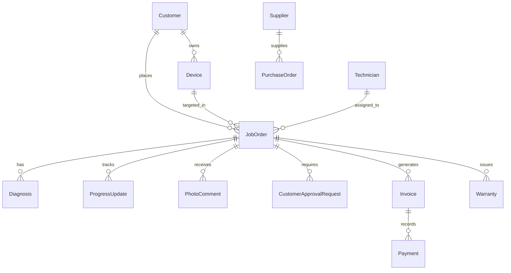

# 🔧 iRepair Shop System — Enterprise Repair Management & Live Customer Tracking

An end-to-end, enterprise-grade Shop Management & Live Device Tracking Platform built with **Laravel**, **Tailwind CSS**, **Alpine.js**, **Chart.js**, and **FontAwesome**.

> 💡 **For Claude AI / LLM Design & Prompting**: This README serves as a comprehensive system architectural overview, database schema blueprint, route mapping, and UI design specification for prompt ingestion and AI-driven UI/UX design enhancement.

---

## 🚀 Key System Modules & Features

### 1. 📱 Public Live Repair Tracking & Customer Portal (`/status`, `/track/{token}`)
- **No-Auth Customer Tracking**: Customers can check repair progress live via Ticket Number `#TICKET-YYYY-XXXX` or secure UUID tracking token.
- **8-Stage Circuit Progress Bar**: Visual lifecycle tracker (`Received` ➔ `Diagnosing` ➔ `Waiting for Parts` ➔ `Under Repair` ➔ `Testing` ➔ `Ready for Pickup` ➔ `Completed` ➔ `Released`).
- **Interactive Approval Workflow**: If technicians discover additional damage or parts needed, customers receive a prominent action prompt to **Approve** or **Decline** additional cost/time directly from their portal.
- **Before / After Photo Gallery with Inline Comments**: High-resolution image comparison for intake vs finished device condition, complete with staff/customer commenting threads.
- **Dynamic ETA Countdown**: Live estimated completion timer in hours/days.

### 2. 🛠️ Job Orders & Repair Ticket Management (`/job_orders`)
- Full intake ticket lifecycle management with technician assignment, fault severity/priority classification (`Low`, `Normal`, `High`, `Urgent`), and labor/parts cost calculation.
- Digital customer sign-off signature capture and printable official intake receipts.
- Live progress update timber logging (staff notes & customer-facing updates).
- AI-assisted diagnostic suggestions for common device issues.

### 3. 📦 Inventory, Parts & Barcode System (`/inventory`)
- Real-time spare parts stock tracking, low-stock threshold triggers, and stock adjustment logs.
- Automated barcode generation and printable barcode labels for quick scanner entry.
- Direct linking of inventory parts to job orders with automatic stock reduction.

### 4. 🚚 Suppliers & Restock Purchase Orders (`/suppliers`)
- Supplier directory with restock lead times and contact info.
- Purchase Order (PO) creation, stock receiving workflow, and automatic inventory updating.

### 5. 👨‍🔧 Technician Workload & Performance (`/technicians`)
- Technician skill tagging, active ticket queue allocation, completed job counts, and performance metrics.

### 6. 💰 Invoicing, Billing & Receipts (`/invoices`)
- One-click invoice generation from job order totals (Labor + Parts).
- Multi-payment recording (Cash, GCash/E-Wallet, Card, Bank Transfer) denominated in Philippine Peso (`₱`).
- Printable Official Receipts and downloadable PDF invoices.

### 7. 🛡️ Warranty & Claims Management (`/warranties`)
- Automated warranty coverage tracking post-repair release.
- Claims filing, inspection notes, and approval/rejection handling.

### 8. 📊 Reports & Analytics (`/reports`, `/dashboard`)
- Real-time revenue dashboards, monthly income trend charts, and 3-month moving average forecasting.
- Ticket breakdown metrics and stock movement logs.

### 9. 🔒 System Administration & Security (`/users`, `/audit_logs`, `/backups`)
- Role-Based Access Control (Spatie RBAC): `Administrator`, `Technician`, `FrontDesk Staff`.
- Comprehensive audit trail logging for security compliance.
- Database backup creation, direct download, and restore triggers.

---

## 🎨 UI/UX Design & Aesthetic Blueprint

| Token / Element | Technical Specs | Usage & Context |
|---|---|---|
| **Primary Theme** | Dark Slate Tech Void (`#0B0B0C`, `#17181A`, `#161b26`) | High-contrast dark mode tailored for long repair shop shifts |
| **Accent Primary** | Amber Gold (`#F5A623` / `#f59e0b`) | Primary action buttons, active tabs, highlight text, progress fills |
| **Accent Secondary**| Deep Amber / Copper (`#B97A1A` / `#7A4A12`) | Borders, muted badges, secondary icons |
| **Status Green** | Signal Emerald (`#35D07F` / `#10b981`) | Ready for pickup, completed, revenue stats, positive indicators |
| **Alert Red** | Crimson Alert (`#E5484D` / `#ef4444`) | Urgent priority, stock warning, decline buttons |
| **Typography** | `Oswald` (Display), `Inter` (Body), `JetBrains Mono` (Data) | Headers, clean body copy, financial values (`₱`), ticket numbers |
| **Background Texture**| PCB Hexagon Grid Pattern | Flat subtle tech background texture |

---

## 🗄️ Database Architecture & Key Models



- **`User`** / **`Technician`**: Staff accounts, authentication, Spatie roles.
- **`Customer`**: Contact details, email, phone, repair history.
- **`Device`**: Brand, model, serial number, color, device type.
- **`JobOrder`**: Ticket number, status stage, priority, estimated date, tracking token, total labor cost, total parts cost, final total.
- **`Diagnosis`**: Fault description, recommended fix, parts required, AI suggestions.
- **`Part`** / **`Inventory`**: SKU, name, unit cost, selling price, stock quantity, low stock alert level.
- **`ProgressUpdate`**: Timestamped status changes, technician notes, public flag.
- **`CustomerApprovalRequest`**: Title, description, additional cost, additional days, status (`Pending`, `Approved`, `Declined`).
- **`Invoice`** / **`Payment`**: Payment method, amount paid, balance, status (`Unpaid`, `Partial`, `Paid`).
- **`Warranty`**: Valid until date, terms, claim history.
- **`AuditLog`**: User ID, action, model, IP address, changes payload.

---

## 🛣️ Route Architecture (`routes/web.php`)

### Public Routes (No Authentication)
- `GET /status`: Public repair tracking search page
- `POST /status/lookup`: Ticket number search handler
- `GET /status/{ticket_number}`: Live repair status view
- `GET /track/{token}`: Direct token tracking view
- `POST /track/{token}/respond/{approval_request}`: Public customer approve/decline handler
- `POST /track/{token}/photo-comments`: Customer photo comment handler

### Staff Authenticated Routes (`middleware: auth`)
- `GET /dashboard`: Shop analytics & metric cards
- `RESOURCE /job_orders`: CRUD job orders + status patches, technician assignment, parts attachment, receipt printing, photo uploads, signatures
- `RESOURCE /customers`: Customer management
- `RESOURCE /devices`: Device management
- `RESOURCE /inventory`: Stock control, adjustments, barcode printing
- `RESOURCE /suppliers`: Supplier management & Purchase Orders
- `RESOURCE /technicians`: Technician management
- `RESOURCE /invoices`: Billing management, receipt generation, PDF downloads
- `RESOURCE /warranties`: Warranty tracking & claim filing
- `GET /reports`: Analytics reports
- `RESOURCE /users`: Admin staff & roles management
- `GET /audit_logs`: Audit trail viewer
- `RESOURCE /backups`: Database backup creation & restore

---

## 🛠️ Stack & Installation Setup

### Prerequisites
- PHP 8.2+ with SQLite / MySQL
- Composer
- Node.js & NPM

### Setup Instructions
```bash
# 1. Clone repository & install PHP dependencies
composer install

# 2. Install NPM dependencies & build assets
npm install
npm run dev

# 3. Environment configuration
cp .env.example .env
php artisan key:generate

# 4. Run database migrations & seeders
php artisan migrate --seed

# 5. Serve application locally
php artisan serve
```

---

## 🧠 Prompts & Instructions for Claude AI

When feeding this project to **Claude AI** for UI redesign or feature enhancement, use the following context prompt:

```text
You are an expert UI/UX Designer and Senior Laravel Developer.
You are working on the "iRepair Shop System" codebase (described in the README.md above).

Design Goals:
1. Make the UI exceptionally user-friendly, modern, intuitive, and clean for both repair staff and customers.
2. Maintain high contrast with dark slate cards (#151c28), amber gold accents (#f59e0b), and clear status badges.
3. Optimize tables, form inputs, status progress bars, and mobile responsiveness.
4. Ensure all currency amounts use the Philippine Peso symbol (₱).
5. Leverage Alpine.js for micro-interactions and smooth transitions.
```
