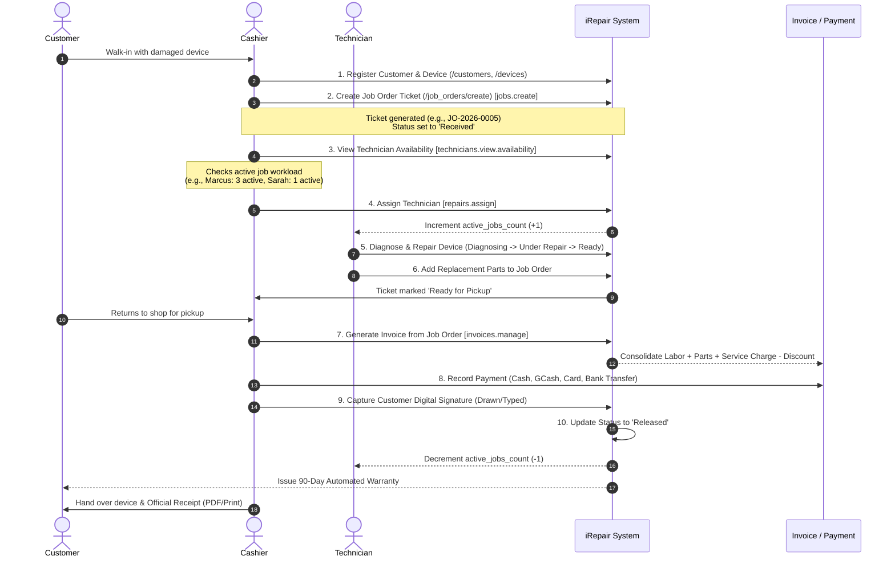

# 🔧 iRepair Shop System — Enterprise Repair Management & Live Customer Tracking

An end-to-end, enterprise-grade Shop Management & Live Device Tracking Platform built with **Laravel**, **Spatie Roles & Permissions**, **Tailwind CSS**, **Alpine.js**, **Chart.js**, and **FontAwesome**. Designed specifically for repair shops, electronics service centers, and computer technicians.

---

## 📋 Table of Contents
1. [🌟 Key System Features](#-key-system-features)
2. [🛡️ Role-Based Access Control (RBAC) Architecture](#%EF%B8%8F-role-based-access-control-rbac-architecture)
3. [💳 ⭐ HIGHLIGHT: Cashier Role & Technician Assignment Transactions](#-highlight-cashier-role--technician-assignment-transactions)
4. [🛠️ Core System Modules](#%EF%B8%8F-core-system-modules)
5. [🗄️ Database Architecture & Entity Relationships](#%EF%B8%8F-database-architecture--entity-relationships)
6. [🎨 UI/UX Design System & Theme Specifications](#-uiux-design-system--theme-specifications)
7. [🛣️ Complete Route & Permission Reference](#%EF%B8%8F-complete-route--permission-reference)
8. [🚀 Installation, Setup & Default Credentials](#-installation-setup--default-credentials)
9. [🧠 Claude AI / LLM Context & Guidelines](#-claude-ai--llm-context--guidelines)

---

## 🌟 Key System Features

- **📱 Public Live Repair Tracking**: Customers check real-time progress using Ticket Numbers (`JO-YYYY-XXXX`) or direct UUID tokens without needing an account.
- **8-Stage Circuit Lifecycle Tracker**: Visual progress bar (`Received` ➔ `Diagnosing` ➔ `Waiting for Parts` ➔ `Under Repair` ➔ `Testing` ➔ `Ready for Pickup` ➔ `Completed` ➔ `Released`).
- **🤝 Customer Cost & Time Approval Workflow**: Direct online customer approval/decline interface for secondary repair estimates or extra parts requirements.
- **🖼️ Before / After Photo Gallery**: Staff upload high-resolution repair documentation photos with multi-threaded customer and staff comment threads.
- **👨‍🔧 Smart Technician Workload Allocation**: Real-time technician availability inspection and active workload tracking (`active_jobs_count`).
- **🧾 Billing & Multi-Payment Processing**: One-click invoice generation consolidating labor costs, replacement parts, service charges, and percentage/flat discounts into Philippine Peso (`₱`) receipts.
- **✍️ Digital Signatures & Auto-Warranty**: Canvas-drawn signature capture upon release, triggering automated 90-day parts & labor warranty policies.

---

## 🛡️ Role-Based Access Control (RBAC) Architecture

The system implements a granular 5-role permission system using `spatie/laravel-permission`:

| Role Slug | Display Name | Core Responsibilities | Key Granted Permissions |
|---|---|---|---|
| `admin` | **System Administrator** | Full system configuration, security, user administration, database backups, audit trail inspection. | Bypasses permission checks (`Gate::before`) |
| `shop_manager` | **Shop Manager** | Day-to-day operations, repair management, inventory catalog, customer oversight, financial reporting. | `dashboard.view.all`, `repairs.manage`, `repairs.assign`, `technicians.manage`, `jobs.manage.full`, `invoices.manage`, `reports.view.financial` |
| `technician` | **Repair Technician** | Technical diagnosis, updating repair status, adding replacement parts to jobs, uploading repair photos. | `repairs.view.own`, `repairs.manage` *(Scoped via `RepairJobPolicy`)*, `diagnosis.manage`, `parts.usage.create`, `estimation.manage.limited` |
| `inventory_staff` | **Inventory Manager** | Parts catalog control, stock count adjustments, barcode printing, supplier directory, purchase orders (POs). | `dashboard.view.inventory`, `parts.catalog.manage`, `parts.usage.view`, `suppliers.manage`, `notifications.trigger.inventory`, `reports.view.inventory` |
| `cashier` | **Cashier / Front-Desk** | Customer intake, device registration, repair ticket creation, technician assignment, invoice billing, payment collection, customer signature capture, repair releases. | `jobs.create`, `jobs.manage.full`, `repairs.assign`, `technicians.view.availability`, `customers.manage`, `invoices.manage`, `notifications.trigger.customer`, `reports.view.sales` |

---

## 💳 ⭐ HIGHLIGHT: Cashier Role & Technician Assignment Transactions

The **Cashier** serves as the front-of-house anchor of the repair shop workflow. Below is the complete step-by-step transaction life-cycle handled by the Cashier, from walk-in device intake to technician assignment, financial settlement, signature capture, and device release.



### Detailed Phase-by-Phase Cashier Transaction Guide

#### 1. Device Intake & Customer Registration (`jobs.create`, `customers.manage`)
- **Route**: `GET /job_orders/create`, `POST /job_orders`
- **Actions**:
  - The Cashier registers new customers or searches existing profiles by phone number/name.
  - Registers device details (Brand, Model, Serial Number, Physical Color, Passcode).
  - Selects fault priority (`Low`, `Normal`, `High`, `Urgent`) and enters reported issue notes.
  - Enters initial labor cost and shop service fee estimates.
  - On submission, the system generates a unique tracking ticket (`JO-YYYY-XXXX`) and sends an automated SMS alert to the customer with their tracking link.

#### 2. Smart Technician Availability & Workload Assignment (`repairs.assign`, `technicians.view.availability`)
- **Route**: `POST /job_orders/{job_order}/assign_technician`
- **Logic**:
  - Cashiers are granted access to a real-time availability view (`GET /technicians-availability`) showing technician specialties and current open ticket counts (`active_jobs_count`).
  - Cashier selects the optimal technician based on workload capacity and expertise (e.g. Micro-soldering vs Screen Replacement).
  - **Automated Workload Tracking**:
    - Assigning a technician increments `$technician->increment('active_jobs_count')`.
    - Re-assigning a ticket automatically decrements the former technician's count and increments the newly assigned technician's count.

#### 3. Technician Diagnosis & Scoped Repair Execution
- **Route**: `POST /job_orders/{job_order}/diagnosis`, `POST /job_orders/{job_order}/parts`
- **Policy Scoping**: `RepairJobPolicy` ensures Technicians can only access and update jobs assigned directly to them (`technician_id === auth()->id()`). Cashiers maintain overall status visibility (`repairs.view.status`).
- If additional repair costs arise, Technicians create a Customer Approval Request. Cashiers can also resolve customer declines via `POST /job_orders/{job_order}/resolve_declined/{approval_request}`.

#### 4. Cost Recalculation & Invoice Generation (`invoices.manage`)
- **Route**: `POST /job_orders/{job_order}/generate_invoice`
- **Logic**:
  - When repair is marked `Ready for Pickup`, the Cashier triggers one-click invoice creation.
  - The system automatically compiles:
    1. **Labor Fee**: `job_order.labor_cost`
    2. **Parts Line Items**: Every `JobOrderPart` attached to the repair (Quantity × Unit Selling Price)
    3. **Service Charge**: `job_order.service_fee`
    4. **Discounts**: Applies Percentage (`%`) or Fixed Amount (`₱`) discounts.
  - Calculates `subtotal`, `discount_amount`, and `total_amount`.

#### 5. Multi-Payment Transaction Recording (`invoices.manage`)
- **Route**: `POST /invoices/{invoice}/payments`
- **Supported Payment Methods**:
  - 💵 **Cash**
  - 📱 **GCash / E-Wallet** (with Reference Number)
  - 💳 **Credit / Debit Card** (with Reference Number)
  - 🏦 **Bank Transfer**
- Cashiers can record single full payments or partial split-payments. The system updates invoice status dynamically (`unpaid` ➔ `partial` ➔ `paid`).

#### 6. Signature Capture, Device Release & Auto-Warranty
- **Route**: `POST /job_orders/{job_order}/signature`
- **Actions**:
  - Cashier presents the customer with a digital signature pad (Canvas-drawn signature or typed confirmation).
  - Saving the signature updates the repair status to **`Released`** and logs `released_at = now()`.
  - **Automated Actions on Release**:
    1. Decrements assigned technician's active workload (`$technician->decrement('active_jobs_count')`).
    2. Automatically creates an active **90-Day Warranty** record (`Warranty::create(...)`).
    3. Cashier prints the **Official Receipt** (`GET /invoices/{invoice}/receipt`) or exports a **PDF Invoice** (`GET /invoices/{invoice}/pdf`).

---

## 🛠️ Core System Modules

### 1. 📱 Public Live Repair Tracking (`/status`, `/track/{token}`)
- **No-Auth Lookup**: Search by ticket number `JO-YYYY-XXXX` or direct token.
- **8-Stage Circuit Progress Bar**: Live stage highlighting and estimated time remaining.
- **Interactive Approvals**: Customers accept or decline extra charges online.
- **Photo Comments Thread**: Direct photo comment communication between customer and staff.

### 2. 📋 Job Orders & Ticket Management (`/job_orders`)
- Intake management, priority tagging, diagnostic notes, labor/parts accounting.
- Live progress update timber logging (staff notes & public updates).
- AI-assisted diagnostic suggestions for common device faults.

### 3. 📦 Inventory, Parts & Barcode System (`/inventory`)
- Real-time stock counts, minimum threshold alerts, and stock adjustment logs.
- Automatic stock deduction upon adding parts to job orders (`StockMovement` logging).
- Printable barcode labels for quick scanner entry.

### 4. 🚚 Suppliers & Restock Purchase Orders (`/suppliers`)
- Supplier contact management and restock lead times.
- Purchase Order (PO) creation, stock receiving workflow, and inventory updating.

### 5. 👨‍🔧 Technician Performance & Availability (`/technicians`)
- Technician skill tagging, active job queues, rating scores, and completion counts.
- Availability modal for front-desk cashiers during ticket assignment.

### 6. 💰 Invoicing, Billing & Receipts (`/invoices`)
- Dynamic line-item billing, multi-payment logging, balance due tracking.
- Printable thermal-style official receipts and formal downloadable PDF invoices.

### 7. 🛡️ Warranty & Claims Management (`/warranties`)
- Auto-generated 90-day coverage post-release.
- Claims filing, inspection logs, and warranty claim status resolution (`pending`, `approved`, `rejected`).

### 8. 📊 Reports & Financial Analytics (`/reports`)
- Monthly revenue trends, ticket breakdown metrics, technician efficiency statistics.

### 9. 🔒 System Auditing & Backups (`/audit_logs`, `/backups`, `/users`)
- Detailed user activity audit logging with IP tracking and payload details.
- One-click SQLite/MySQL database backup creation, direct download, and restore triggers.

---

## 🗄️ Database Architecture & Entity Relationships

```mermaid
erDiagram
    User ||--o{ AuditLog : performs
    User ||--o? Technician : links_to
    Customer ||--o{ Device : owns
    Customer ||--o{ JobOrder : requests
    Device ||--o{ JobOrder : processed_in
    Technician ||--o{ JobOrder : assigned_to
    JobOrder ||--o{ Diagnosis : contains
    JobOrder ||--o{ JobOrderPart : requires
    Part ||--o{ JobOrderPart : supplies
    Part }|--|| PartCategory : belongs_to
    Supplier ||--o{ PurchaseOrder : provides
    JobOrder ||--o? Invoice : generates
    Invoice ||--o{ Payment : receives
    JobOrder ||--o? Warranty : issues
    Warranty ||--o{ WarrantyClaim : incurs
```

---

## 🎨 UI/UX Design System & Theme Specifications

| Token / Element | Technical Specification | Usage & Context |
|---|---|---|
| **Primary Theme** | Dark Slate Tech Void (`#0B0B0C`, `#151c28`, `#1e293b`) | High-contrast dark theme optimized for repair shop environments |
| **Accent Primary** | Amber Gold (`#F5A623` / `#f59e0b`) | Primary action buttons, active navigation indicators, progress fills |
| **Accent Secondary**| Deep Amber / Copper (`#B97A1A` / `#7A4A12`) | Borders, muted badges, secondary card outlines |
| **Status Emerald** | Signal Emerald (`#35D07F` / `#10b981`) | Paid invoices, completed repairs, ready for pickup, positive metrics |
| **Alert Red** | Crimson Alert (`#E5484D` / `#ef4444`) | Urgent tickets, low inventory warnings, customer decline alerts |
| **Typography** | `Oswald` (Display), `Inter` (Body), `JetBrains Mono` (Data) | Headers, clean UI body text, currency values (`₱`), ticket numbers |
| **Currency** | Philippine Peso (`₱`) | All financial figures formatted with two decimal places (`₱#,##0.00`) |

---

## 🛣️ Complete Route & Permission Reference

| HTTP Method | URI Route | Controller Action | Required Permission / Policy |
|---|---|---|---|
| `GET` | `/status` | `CustomerPortalController@index` | Public (No Auth) |
| `GET` | `/status/{ticket}` | `CustomerPortalController@show` | Public (No Auth) |
| `GET` | `/track/{token}` | `CustomerPortalController@track` | Public (No Auth) |
| `POST` | `/track/{token}/respond/{approval}` | `CustomerApprovalController@respond` | Public (No Auth) |
| `GET` | `/dashboard` | `DashboardController@index` | `auth` |
| `RESOURCE`| `/customers` | `CustomerController` | `customers.view` / `customers.manage` |
| `RESOURCE`| `/devices` | `DeviceController` | `customers.view` / `customers.manage` |
| `GET` | `/job_orders` | `JobOrderController@index` | `repairs.view.own` / `repairs.view.status` / `jobs.manage.full` |
| `GET` | `/job_orders/create` | `JobOrderController@create` | `jobs.create` (Granted to `cashier`, `shop_manager`, `admin`) |
| `POST` | `/job_orders` | `JobOrderController@store` | `jobs.create` |
| `POST` | `/job_orders/{id}/assign_technician` | `JobOrderController@assignTechnician` | `repairs.assign` (Granted to `cashier`, `shop_manager`, `admin`) |
| `PATCH` | `/job_orders/{id}/status` | `JobOrderController@updateStatus` | `RepairJobPolicy@manage` |
| `POST` | `/job_orders/{id}/parts` | `JobOrderController@addPart` | `parts.usage.create` |
| `POST` | `/job_orders/{id}/generate_invoice` | `InvoiceController@generateFromJob` | `invoices.manage` (Granted to `cashier`, `shop_manager`, `admin`) |
| `GET` | `/invoices/{id}` | `InvoiceController@show` | `invoices.manage` |
| `POST` | `/invoices/{id}/payments` | `InvoiceController@recordPayment` | `invoices.manage` |
| `GET` | `/invoices/{id}/receipt` | `InvoiceController@printReceipt` | `invoices.manage` |
| `GET` | `/invoices/{id}/pdf` | `InvoiceController@downloadPdf` | `invoices.manage` |
| `POST` | `/job_orders/{id}/signature` | `JobOrderController@saveSignature` | `RepairJobPolicy@manage` |
| `GET` | `/technicians-availability` | `TechnicianController@availability` | `technicians.view.availability` |
| `RESOURCE`| `/inventory` | `InventoryController` | `parts.catalog.manage` |
| `RESOURCE`| `/suppliers` | `SupplierController` | `suppliers.manage` / `suppliers.view` |
| `RESOURCE`| `/warranties` | `WarrantyController` | `warranty.view` / `warranty.manage` |
| `GET` | `/reports` | `ReportController@index` | `reports.view.sales` / `reports.view.financial` |
| `RESOURCE`| `/users` | `UserController` | `users.manage.full` / `users.manage.limited` |
| `GET` | `/audit_logs` | `AuditLogController@index` | `audit.view` |
| `RESOURCE`| `/backups` | `BackupController` | `backup.manage` |

---

## 🚀 Installation, Setup & Default Credentials

### Prerequisites
- PHP 8.2+ with SQLite or MySQL extension
- Composer
- Node.js (v18+) & NPM

### Setup Execution
```bash
# 1. Clone repository & install PHP dependencies
composer install

# 2. Install NPM packages & compile frontend assets
npm install
npm run dev

# 3. Configure environment file
cp .env.example .env
php artisan key:generate

# 4. Execute database migrations & seed demo data
php artisan migrate --seed

# 5. Launch local development server
php artisan serve
```

### Pre-seeded Demo Accounts

All accounts use the default password: **`password`**

| Role | Name | Email | Primary Responsibilities to Test |
|---|---|---|---|
| **System Admin** | System Admin | `admin@irepair.com` | Unrestricted access, system config, audit logs, backups |
| **Shop Manager** | Elena Rostova | `manager@irepair.com` | Store management, staff accounts, financial reports |
| **Cashier (Front-Desk)** | Emily Davis | `cashier@irepair.com` | **Intake, assigning technicians, generating invoices, recording payments, releasing devices** |
| **Technician 1** | Marcus Vance | `tech1@irepair.com` | iPhone & Micro-soldering repair queue management |
| **Technician 2** | Sarah Lin | `tech2@irepair.com` | MacBook & Board repair queue management |
| **Inventory Staff** | Alex Rivera | `inventory@irepair.com` | Stock management, supplier POs, barcode printing |

---

## 🧠 Claude AI / LLM Context & Guidelines

When submitting this project to **Claude AI** or LLM assistants for UI design updates or feature extensions, include the following instruction block:

```text
You are an expert Senior Laravel Developer and Lead UI/UX Designer.
You are working on the "iRepair Shop System" codebase detailed in this README.md.

Implementation Constraints:
1. Maintain Spatie RBAC role boundaries (especially Cashier intake/assignment and Technician job-scoping via RepairJobPolicy).
2. Maintain high-contrast dark theme aesthetics (#151c28 slate backgrounds, #f59e0b amber gold primary accents, #10b981 emerald status indicators).
3. All financial and monetary figures MUST display the Philippine Peso symbol (₱).
4. Utilize Alpine.js for smooth front-end micro-interactions, modal overlays, and signature canvas rendering.
```
